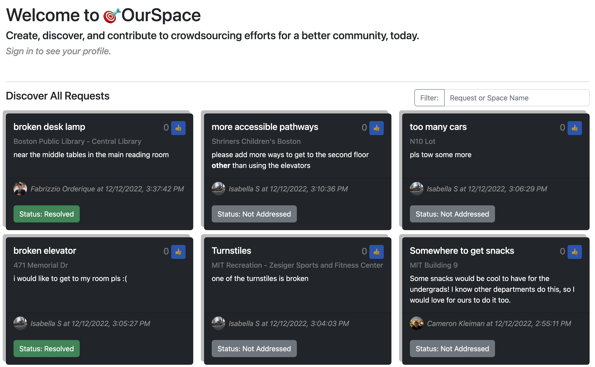

<div align="center">

</div>
<h1 align="center"> 🎯OurSpace: 
discover, request, and contribute to spaces in your community! </h1>
<h3 align="center"> 6.1040 Software Studio </h3>
<h5 align="center">  Final Project - Fall 2022</h5>

<h2 align="center"> Quick Links </h2>
<div align = "center">
<a ref="https://ourspace-project.vercel.app/">
</a>
<a href="https://61040-fa22.github.io/about/">
</a>
<a href="https://6-1040-final-project-docs.vercel.app/">
</a>
</div>

<h2> About the Project </h2>
<p align="justify"> 
Service issues happen daily across our campus, as well as the millions of shared spaces and facilities around the country. The current status quo of raising service requests individually to administrations works to identify singular problems, but doesn't really provide a domain to discover the unspoken shared desires of a community. Surveys can help uncover possible improvements and shortcomings for spaces, but often suffer from non-response and sampling bias, and rely on the initiative of the administrative body facilitating the survey.
</p>

<h2> Overview </h2>
<p align="justify">
🎯OurSpace enables crowdsourced service requests of communal spaces, and thus provides a domain where users can share their opinions and amplify their unspoken ideas- as well as discover new spaces within their community. 🎯OurSpace strives to serve as a tool to collect voices and ideas about the 90% of issues about community spaces that are often missed due to a lack of community platform. 
</p>

<h2> 

<h2> Tech Stack </h2>
Here's a high-level overview of the tech stack 🎯OurSpace uses:

 - This project was developed in [Vue 3](https://vuejs.org/guide/introduction.html) + [TypeScript](https://www.typescriptlang.org/docs/handbook/declaration-files/introduction.html)
 - For storage, the app uses [Mongo DB](https://www.mongodb.com/docs/manual/introduction/), which serves all our needs with document-based databasing. 
 - API routes uses [OpenAPI Specification](https://swagger.io/specification/) which allows easy defining of a standard, language-agnostic interface to our RESTful API.
 - For UI deployment, the app uses [Vercel](https://vercel.com/docs).

### Useful IDE References
- [VSCode](https://code.visualstudio.com/) + [Volar](https://marketplace.visualstudio.com/items?itemName=Vue.volar) (and disable Vetur) + [TypeScript Vue Plugin (Volar)](https://marketplace.visualstudio.com/items?itemName=Vue.vscode-typescript-vue-plugin).
- [Open API Editor](https://marketplace.visualstudio.com/items?itemName=42Crunch.vscode-openapi)
 - [Vite Configuration Reference](https://vitejs.dev/config/)
## Project Setup
```sh
npm install
```
### Compile and Hot-Reload for Development
```sh
npm run dev
npm run dev-api
```
`dev-api` will automatically reload the server when you make changes to the API server, and requests will be proxied through the Vite dev server.
### View OpenAPI Docs
```sh
npm run dev-api
npm run docs
```
Then, open [127.0.0.1:8080](http://127.0.0.1), and you'll be able to browse and execute the OpenAPI endpoints.

### Type-Check, Compile and Minify for Production
```sh
npm run build
```
### Lint with [ESLint](https://eslint.org/)
```sh
npm run lint
```